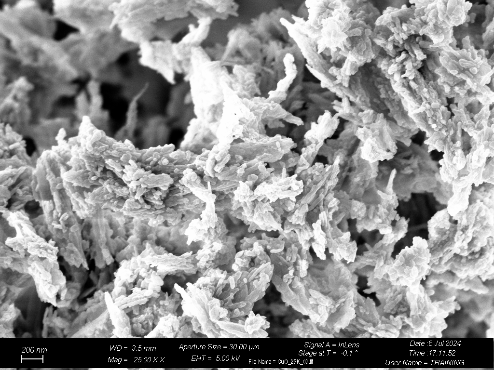
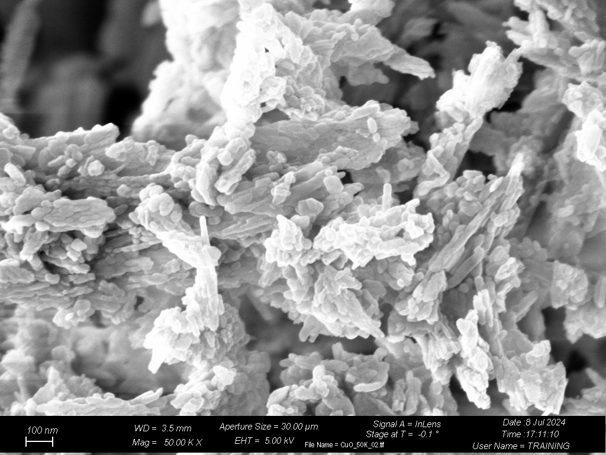
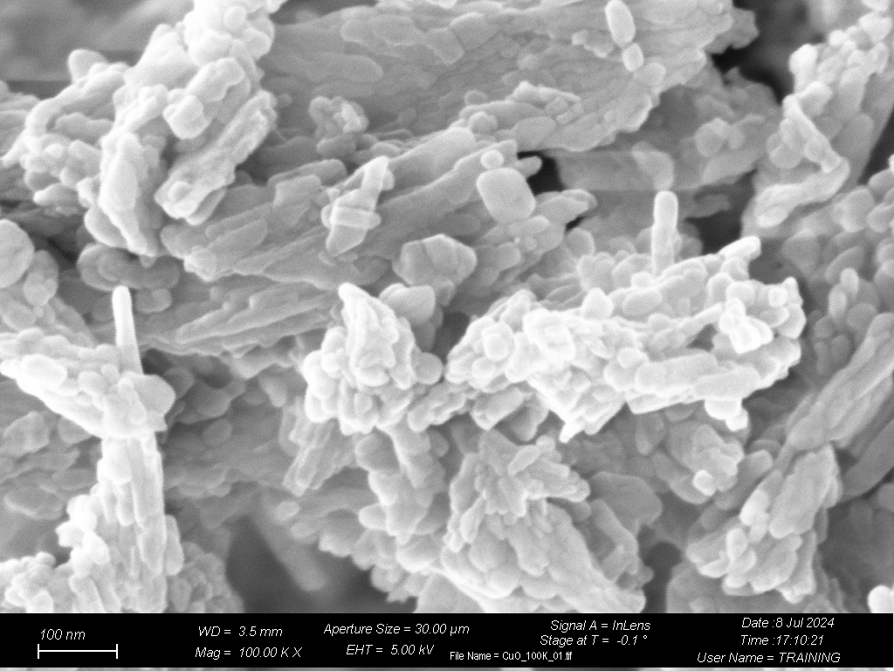
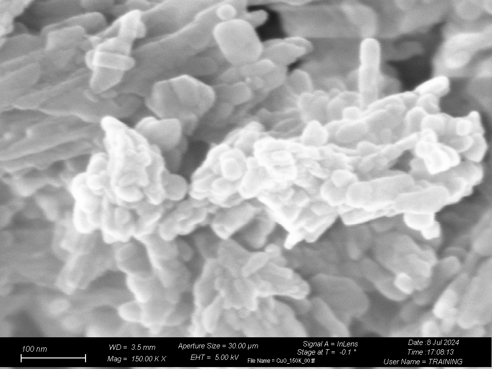

# Methods
A ZEISS Supra 40 Field Emission Scanning Electron Microscopy (FESEM) was employed to characterize the morphology of the CuO powder electrode. 

# 5K magnification

# 25K magnification

# 50K magnification

# 100K magnification

# 150K magnification

